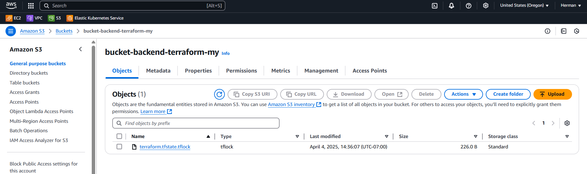
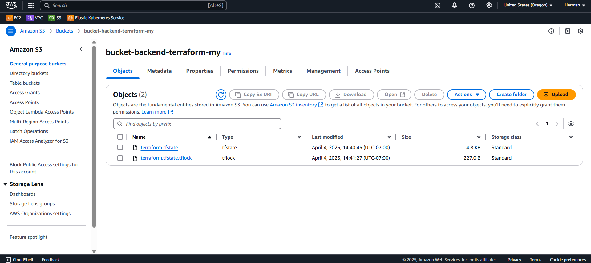

# lab-week-13-terraform-backend

## Create S3 bucket
1. In your **scripts** directory, use `./create-bucket <bucket>` to create a new bucket

## Create Terraform resources
1. In your **terraform** directory, use `terraform init` to initialize the project directory with provider plugins
1. In your **terraform** directory, use `terraform plan` to view the plan of the project resources
1. In your **terraform** directory, use `terraform apply` to provision the project resource

## Clean up
1. In your **terraform** directory, use `terraform destroy` to take down your resources
1. In your **scripts** directory, use `./delete-bucket <bucket>` to clean up your ssh key from your AWS account 

## Q&A
- When is the state file created?
  - Locally on `terraform init`
- When is the lock file present?
  - Remotely on `terraform plan`
- Is the lock file always in the bucket after it is created?
  - No, it is only present during the running process of `terraform plan` and `terraform apply`

## Screenshots
- Lock file present on `terraform plan`

- Lock and state file present on `terraform plan` or `terraform apply` AFTER `terraform apply`

